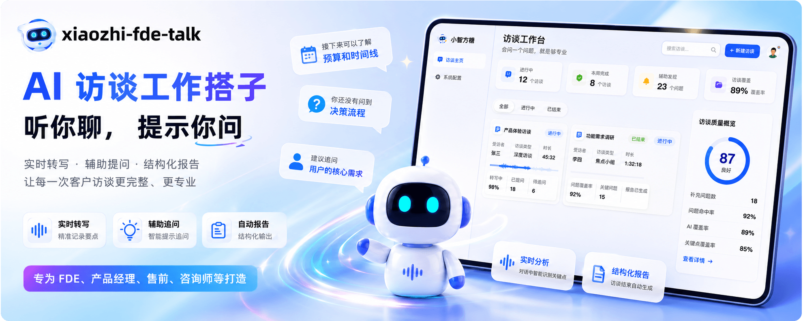

<div align="center">


# 小智方糖xiaozhi-fde-talk

### 不只是录音转写，而是会"听你聊、提示你问"的 AI 访谈搭档

**面向 FDE、产品经理、售前、咨询师等需要频繁做客户访谈的角色**

和转写、录音工具不同，它在你访谈过程中实时分析对话，提示你"接下来该问什么、哪些关键点还没问到"，结束自动生成结构化需求报告。让每次访谈更完整、更专业，减少事后补漏。

[快速开始](#-快速开始) · [WebSocket 通信协议](docs/websocket-protocol.md) · [问题反馈](https://github.com/xinnan-tech/xiaozhi-fde-talk/issues)

</div>

## ✨ 核心特性

- 🤖 **实时辅导，告诉你该问什么**：边听边分析对话，提示"接下来该问什么、哪些关键点还没问到"，新手也能像专家一样访谈
- 🎙️ **全程实时转写**：开麦即用，流式转写实时上屏，并作为辅导引擎的输入；FunASR 本地推理，语音数据不出内网
- 📝 **结束自动出可交付报告**：不用事后整理录音，访谈结束即生成结构化需求文档，支持 Markdown / HTML / Word 导出

***

## 🚀 快速开始

### 方式一：本地开发

#### 1.1. 启动 ASR 服务（FunASR Docker）

```bash
# 首次启动会自动下载模型，完成后监听宿主机 10096 端口
docker compose up -d funasr

# 查看模型下载进度
docker compose logs -f funasr
```

后端默认 ASR 地址为 `wss://localhost:10096`，本地开发开箱即连。

#### 1.2. 启动后端

```bash
cd backend
conda create -n xiaozhi-fde-talk python=3.12 -y
conda activate xiaozhi-fde-talk
pip install -r requirements.txt -i https://pypi.tuna.tsinghua.edu.cn/simple
cp .env.example .env
python main.py
```

访谈工作台页面由后端直接托管，浏览器打开 http://localhost:8000 即用，无需单独启动前端。

#### 1.3. 启动前端


```bash
cd frontend
pnpm install
pnpm dev          # 默认监听 http://localhost:8848（VITE_PORT in .env.development）
```

需要打生产包给后端托管时：

```bash
pnpm build
cd ..
rm -rf backend/static/*
cp -rf frontend/dist/. backend/static/
```
执行后，访问 http://localhost:8000 即可支持前后端交互