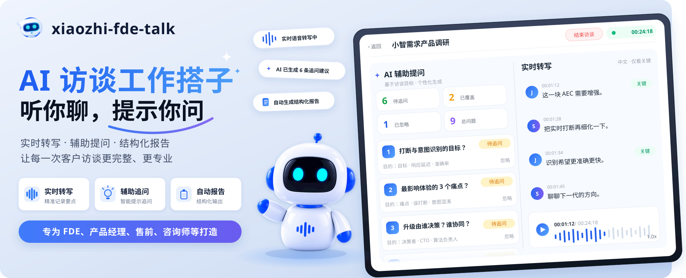

<div align="center">


[](https://opensource.org/licenses/Apache-2.0)
[](https://www.python.org/downloads/)
[](https://nodejs.org/)
[](https://github.com/xinnan-tech/xiaozhi-fde-talk/actions/workflows/frontend-e2e.yml)

[](README.md)
[](docs/I18N/README.en-US.md)
[](docs/I18N/README.vi-VN.md)

# 小智方糖xiaozhi-fde-talk

### 不只是录音转写，而是会"听你聊、提示你问"的 AI 访谈搭档

**面向 FDE、产品经理、售前、咨询师等需要频繁做客户访谈的角色**

和转写、录音工具不同，它在你访谈过程中实时分析对话，提示你"接下来该问什么、哪些关键点还没问到"，结束自动生成结构化需求报告。让每次访谈更完整、更专业，减少事后补漏。

[快速开始](#quick-start) · [WebSocket 通信协议](docs/websocket-protocol.md) · [HTTP 接口协议](docs/http-api.md) · [问题反馈](https://github.com/xinnan-tech/xiaozhi-fde-talk/issues)

</div>

<a id="core-features"></a>

## ✨ 核心特性

- 🤖 **实时辅导，告诉你该问什么**：边听边分析对话，提示"接下来该问什么、哪些关键点还没问到"，新手也能像专家一样访谈
- 🎙️ **全程实时转写**：开麦即用，流式转写实时上屏，并作为辅导引擎的输入；FunASR 本地推理，语音数据不出内网
- 📝 **结束自动出可交付报告**：不用事后整理录音，访谈结束即生成结构化需求文档，支持 Markdown / HTML / Word 导出

***

<a id="quick-start"></a>

## 🚀 快速开始

<a id="local-development"></a>

### 方式一：本地开发

<a id="asr-service-funasr-docker"></a>

#### 1.1. 启动 ASR 服务（FunASR Docker）

```bash
# 首次启动会自动下载模型，完成后监听宿主机 10096 端口
docker compose up -d funasr

# 查看模型下载进度
docker compose logs -f funasr
```

后端默认 ASR 地址为 `wss://localhost:10096`，由系统配置 `asr.ws_url` 提供
（首次启动时自动种入默认值），不在 `.env` 里配——本地开发开箱即连。

<a id="start-the-backend"></a>

#### 1.2. 启动后端

```bash
cd backend
conda create -n xiaozhi-fde-talk python=3.12 -y
conda activate xiaozhi-fde-talk
pip install -r requirements.txt
cp .env.example .env
python main.py
```

国内用户可在`pip install` 后追加 `-i https://pypi.tuna.tsinghua.edu.cn/simple` 走清华镜像加速，默认走官方 PyPI。

启动后，后端接口可以在`http://localhost:8000/docs`查看

<a id="start-the-frontend"></a>

#### 1.3. 启动前端

```bash
cd frontend
pnpm install
pnpm dev
```

<a id="first-run-register-admin"></a>

#### 1.4. 首次启动：注册首位管理员

1. 浏览器打开 http://localhost:8848。
2. 点"去注册" → 填用户名（4-32 位字母数字下划线连字符）、强密码、确认密码。
3. 第一个注册的用户自动成为超级管理员。
4. 登录后，先打开"系统配置"填入 LLM 密钥，否则后续创建访谈会被 LLM 拒绝；填好后点击右上角的"运行自检"，确认 ASR、LLM、OCR 三项都正常。
5. 创建访谈，尝试发出声音。

进一步阅读：[使用教程](docs/用户使用教程.md)（注册 → 系统配置 → 跑访谈 → 导出报告的完整流程）。
