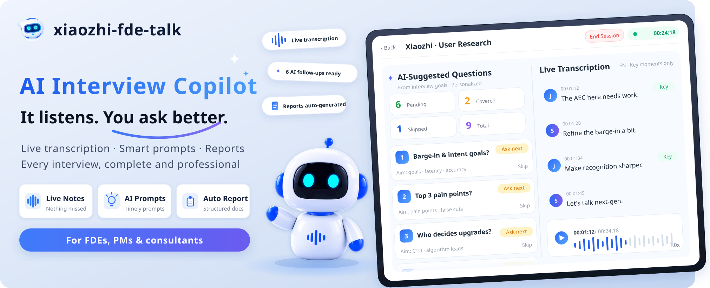

<div align="center">


[](https://opensource.org/licenses/Apache-2.0)
[](https://www.python.org/downloads/)
[](https://nodejs.org/)
[](https://github.com/xinnan-tech/xiaozhi-fde-talk/actions/workflows/frontend-e2e.yml)

[](../../README.md)
[](README.en-US.md)
[](README.vi-VN.md)

# Xiaozhi FDE Talk

### Không chỉ là chuyển giọng nói thành văn bản—mà là trợ lý phỏng vấn AI biết lắng nghe và gợi ý

**Dành cho FDE, Product Manager, pre-sales và tư vấn viên thường xuyên phỏng vấn khách hàng**

Khác với các công cụ chuyển giọng nói hay ghi âm, hệ thống phân tích cuộc trò chuyện theo thời gian thực ngay trong buổi phỏng vấn, gợi ý bạn nên hỏi gì tiếp theo và những điểm quan trọng nào chưa được đề cập. Khi buổi phỏng vấn kết thúc, nó tự động tạo báo cáo yêu cầu có cấu trúc, giúp mỗi buổi phỏng vấn trọn vẹn và chuyên nghiệp hơn, giảm việc bổ sung sau buổi.

[Bắt đầu nhanh](#quick-start) · [Giao thức WebSocket](../websocket-protocol.md) · [HTTP API](../http-api.md) · [Báo lỗi](https://github.com/xinnan-tech/xiaozhi-fde-talk/issues)

</div>

<a id="core-features"></a>

## ✨ Tính năng cốt lõi

- 🤖 **Hỗ trợ theo thời gian thực, mách bạn nên hỏi gì**: vừa nghe vừa phân tích cuộc trò chuyện, nhắc "nên hỏi gì tiếp theo, điểm nào chưa được đề cập", người mới cũng phỏng vấn như chuyên gia
- 🎙️ **Chuyển giọng nói thành văn bản trực tiếp suốt buổi**: bật mic là dùng được, văn bản hiện lên theo thời gian thực và làm đầu vào cho coaching engine; FunASR chạy local nên dữ liệu giọng nói không ra khỏi mạng nội bộ
- 📝 **Tự động xuất báo cáo khi kết thúc**: không cần nghe lại ghi âm để tổng hợp, buổi phỏng vấn vừa kết thúc là có tài liệu yêu cầu có cấu trúc, hỗ trợ xuất Markdown, HTML, Word

***

<a id="quick-start"></a>

## 🚀 Bắt đầu nhanh

<a id="local-development"></a>

### Cách 1: Phát triển trên máy

<a id="asr-service-funasr-docker"></a>

#### 1.1. Khởi động dịch vụ ASR (FunASR Docker)

```bash
# Lần đầu chạy sẽ tự động tải model, sau đó lắng nghe trên cổng 10096 của máy host
docker compose up -d funasr

# Xem tiến trình tải model
docker compose logs -f funasr
```

Backend mặc định lấy địa chỉ ASR là `wss://localhost:10096`, được cung cấp bởi cấu hình hệ thống `asr.ws_url` (tự động seed khi khởi động lần đầu), không cần khai báo trong `.env`—phát triển local dùng được ngay.

<a id="start-the-backend"></a>

#### 1.2. Khởi động backend

```bash
cd backend
conda create -n xiaozhi-fde-talk python=3.12 -y
conda activate xiaozhi-fde-talk
pip install -r requirements.txt
cp .env.example .env
python main.py
```

Người dùng tại Trung Quốc có thể thêm `-i https://pypi.tuna.tsinghua.edu.cn/simple` vào sau `pip install` để dùng gương Tsinghua tải nhanh hơn; mặc định dùng PyPI chính thức.

Sau khi khởi động, tài liệu API của backend xem tại `http://localhost:8000/docs`.

<a id="start-the-frontend"></a>

#### 1.3. Khởi động frontend

```bash
cd frontend
pnpm install
pnpm dev
```

<a id="first-run-register-admin"></a>

#### 1.4. Lần đầu: đăng ký quản trị viên đầu tiên

1. Mở http://localhost:8848 trên trình duyệt
2. Bấm "Đăng ký" → nhập tên đăng nhập (4–32 chữ cái, số, gạch dưới, gạch nối) + mật khẩu mạnh + xác nhận mật khẩu
3. Người đăng ký đầu tiên sẽ tự động trở thành super administrator
4. Sau khi đăng nhập, vào "Cấu hình hệ thống" trước để nhập khóa LLM, rồi bấm "Chạy tự kiểm tra" ở góc trên bên phải để xem từng thành phần có chạy ổn không
5. Tạo một buổi phỏng vấn và thử nói thử

Đọc thêm: [Hướng dẫn sử dụng](用户使用教程.md)（chỉ có tiếng Trung: đăng ký → cấu hình hệ thống → chạy phỏng vấn → xuất báo cáo）.
